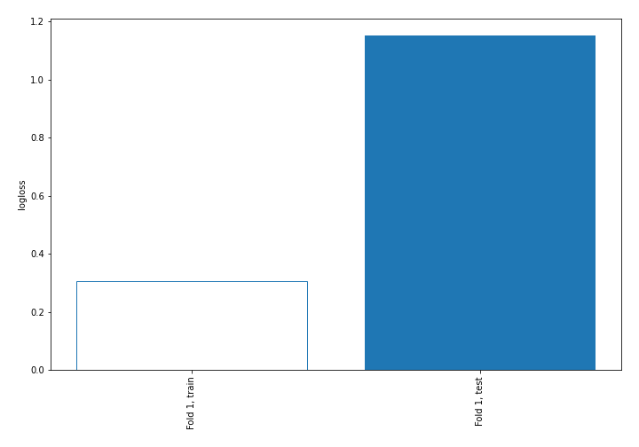

# Summary of 2_DecisionTree

[<< Go back](../README.md)

## Decision Tree
- **n_jobs**: -1
- **criterion**: gini
- **max_depth**: 3
- **explain_level**: 2

## Validation
 - **validation_type**: split
 - **train_ratio**: 0.75
 - **shuffle**: True
 - **stratify**: True

## Optimized metric
logloss

## Training time

11.6 seconds

## Metric details
|           |    score |   threshold |
|:----------|---------:|------------:|
| logloss   | 1.15247  | nan         |
| auc       | 0.744048 | nan         |
| f1        | 0.538462 |   0.0642857 |
| accuracy  | 0.368421 |   0.0642857 |
| precision | 0.368421 |   0.0642857 |
| recall    | 1        |   0.0642857 |
| mcc       | 0        |   0.0642857 |

## Metric details with threshold from accuracy metric
|           |    score |   threshold |
|:----------|---------:|------------:|
| logloss   | 1.15247  | nan         |
| auc       | 0.744048 | nan         |
| f1        | 0.538462 |   0.0642857 |
| accuracy  | 0.368421 |   0.0642857 |
| precision | 0.368421 |   0.0642857 |
| recall    | 1        |   0.0642857 |
| mcc       | 0        |   0.0642857 |

## Confusion matrix (at threshold=0.064286)
|                |   Predicted as No |   Predicted as Yes |
|:---------------|------------------:|-------------------:|
| Labeled as No  |                 0 |                 12 |
| Labeled as Yes |                 0 |                  7 |

## Learning curves

## Decision Tree 

### Tree #1

### Rules

if (Marital status <= 0.5) and (What is your course? <= 22.5) and (Timestamp > 15.5) then class: No (proba: 92.86%) | based on 28 samples

if (Marital status <= 0.5) and (What is your course? <= 22.5) and (Timestamp <= 15.5) then class: No (proba: 69.23%) | based on 13 samples

if (Marital status > 0.5) then class: Yes (proba: 100.0%) | based on 8 samples

if (Marital status <= 0.5) and (What is your course? > 22.5) and (Age <= 19.0) then class: Yes (proba: 100.0%) | based on 4 samples

if (Marital status <= 0.5) and (What is your course? > 22.5) and (Age > 19.0) then class: No (proba: 66.67%) | based on 3 samples

## Permutation-based Importance

## Confusion Matrix

## Normalized Confusion Matrix

## ROC Curve

## Kolmogorov-Smirnov Statistic

## Precision-Recall Curve

## Calibration Curve

## Cumulative Gains Curve

## Lift Curve

## SHAP Importance

## SHAP Dependence plots

### Dependence (Fold 1)

## SHAP Decision plots

### Top-10 Worst decisions for class 0 (Fold 1)

### Top-10 Best decisions for class 0 (Fold 1)

### Top-10 Worst decisions for class 1 (Fold 1)

### Top-10 Best decisions for class 1 (Fold 1)

[<< Go back](../README.md)
