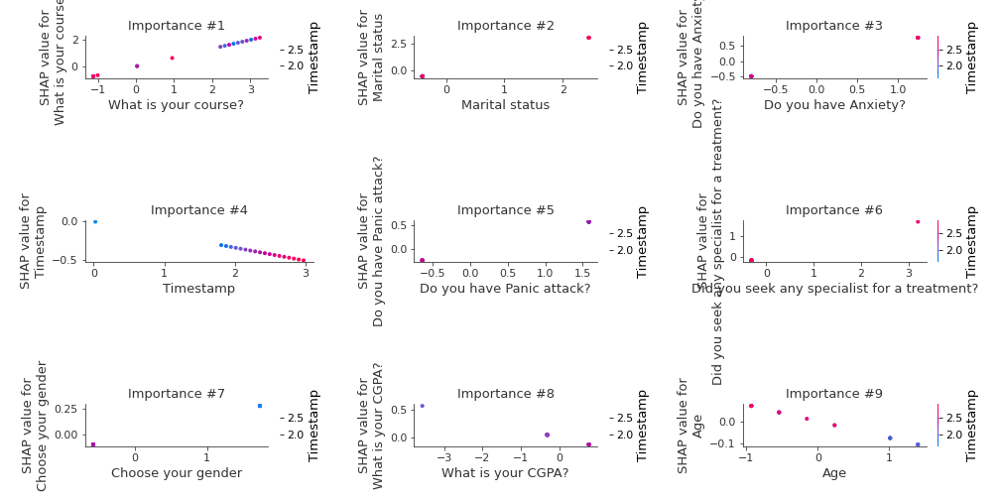

# Summary of 3_Linear

[<< Go back](../README.md)

## Logistic Regression (Linear)
- **n_jobs**: -1
- **explain_level**: 2

## Validation
 - **validation_type**: split
 - **train_ratio**: 0.75
 - **shuffle**: True
 - **stratify**: True

## Optimized metric
logloss

## Training time

3.5 seconds

## Metric details
|           |    score |   threshold |
|:----------|---------:|------------:|
| logloss   | 0.541337 | nan         |
| auc       | 0.75     | nan         |
| f1        | 0.666667 |   0.293765  |
| accuracy  | 0.789474 |   0.745875  |
| precision | 1        |   0.745875  |
| recall    | 1        |   0.0284425 |
| mcc       | 0.566947 |   0.745875  |

## Metric details with threshold from accuracy metric
|           |    score |   threshold |
|:----------|---------:|------------:|
| logloss   | 0.541337 |  nan        |
| auc       | 0.75     |  nan        |
| f1        | 0.6      |    0.745875 |
| accuracy  | 0.789474 |    0.745875 |
| precision | 1        |    0.745875 |
| recall    | 0.428571 |    0.745875 |
| mcc       | 0.566947 |    0.745875 |

## Confusion matrix (at threshold=0.745875)
|                |   Predicted as No |   Predicted as Yes |
|:---------------|------------------:|-------------------:|
| Labeled as No  |                12 |                  0 |
| Labeled as Yes |                 4 |                  3 |

## Learning curves

## Coefficients
| feature                                      |   Learner_1 |
|:---------------------------------------------|------------:|
| Marital status                               |   1.22616   |
| What is your course?                         |   0.654139  |
| Do you have Anxiety?                         |   0.617753  |
| Did you seek any specialist for a treatment? |   0.541116  |
| Do you have Panic attack?                    |   0.355372  |
| Choose your gender                           |   0.161411  |
| Your current year of Study                   |   0.0605409 |
| Age                                          |  -0.0741124 |
| What is your CGPA?                           |  -0.1588    |
| Timestamp                                    |  -0.17209   |
| intercept                                    |  -0.673512  |

## Permutation-based Importance

## Confusion Matrix

## Normalized Confusion Matrix

## ROC Curve

## Kolmogorov-Smirnov Statistic

## Precision-Recall Curve

## Calibration Curve

## Cumulative Gains Curve

## Lift Curve

## SHAP Importance

## SHAP Dependence plots

### Dependence (Fold 1)

## SHAP Decision plots

### Top-10 Worst decisions for class 0 (Fold 1)

### Top-10 Best decisions for class 0 (Fold 1)

### Top-10 Worst decisions for class 1 (Fold 1)

### Top-10 Best decisions for class 1 (Fold 1)

[<< Go back](../README.md)
