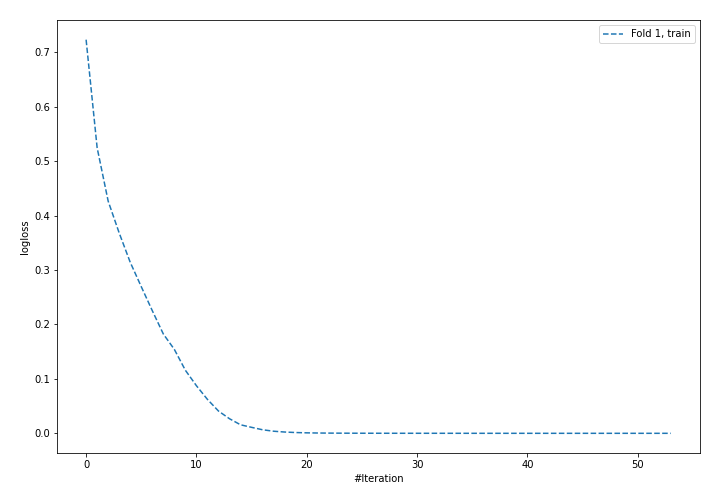

# Summary of 5_Default_NeuralNetwork

[<< Go back](../README.md)

## Neural Network
- **n_jobs**: -1
- **dense_1_size**: 32
- **dense_2_size**: 16
- **learning_rate**: 0.05
- **explain_level**: 2

## Validation
 - **validation_type**: split
 - **train_ratio**: 0.75
 - **shuffle**: True
 - **stratify**: True

## Optimized metric
logloss

## Training time

1.2 seconds

## Metric details
|           |    score |   threshold |
|:----------|---------:|------------:|
| logloss   | 0.508732 |  nan        |
| auc       | 0.785714 |  nan        |
| f1        | 0.769231 |    0.253807 |
| accuracy  | 0.842105 |    0.253807 |
| precision | 1        |    0.587435 |
| recall    | 1        |    0.114474 |
| mcc       | 0.65477  |    0.253807 |

## Metric details with threshold from accuracy metric
|           |    score |   threshold |
|:----------|---------:|------------:|
| logloss   | 0.508732 |  nan        |
| auc       | 0.785714 |  nan        |
| f1        | 0.769231 |    0.253807 |
| accuracy  | 0.842105 |    0.253807 |
| precision | 0.833333 |    0.253807 |
| recall    | 0.714286 |    0.253807 |
| mcc       | 0.65477  |    0.253807 |

## Confusion matrix (at threshold=0.253807)
|                |   Predicted as No |   Predicted as Yes |
|:---------------|------------------:|-------------------:|
| Labeled as No  |                11 |                  1 |
| Labeled as Yes |                 2 |                  5 |

## Learning curves

## Permutation-based Importance

## Confusion Matrix

## Normalized Confusion Matrix

## ROC Curve

## Kolmogorov-Smirnov Statistic

## Precision-Recall Curve

## Calibration Curve

## Cumulative Gains Curve

## Lift Curve

[<< Go back](../README.md)
