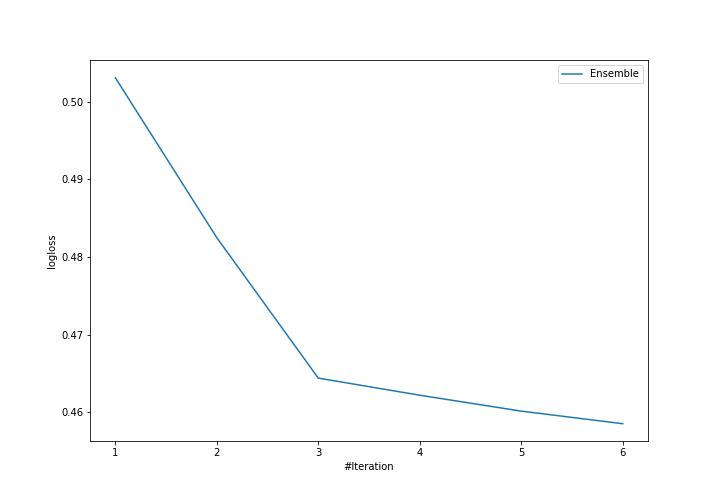
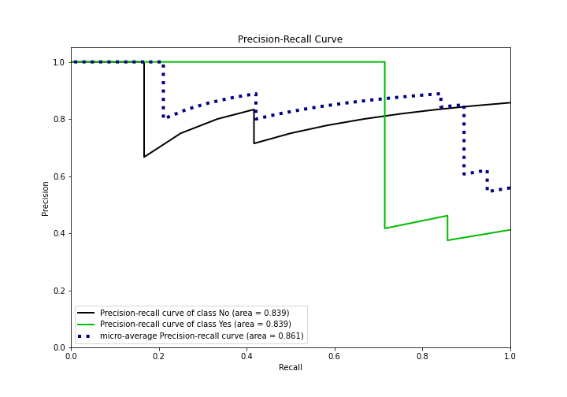

# Summary of Ensemble

[<< Go back](../README.md)

## Ensemble structure
| Model                   |   Weight |
|:------------------------|---------:|
| 2_DecisionTree          |        2 |
| 5_Default_NeuralNetwork |        3 |
| 6_Default_RandomForest  |        1 |

## Metric details
|           |    score |   threshold |
|:----------|---------:|------------:|
| logloss   | 0.45855  |  nan        |
| auc       | 0.797619 |  nan        |
| f1        | 0.727273 |    0.562685 |
| accuracy  | 0.842105 |    0.562685 |
| precision | 1        |    0.736799 |
| recall    | 1        |    0.106188 |
| mcc       | 0.676123 |    0.562685 |

## Metric details with threshold from accuracy metric
|           |    score |   threshold |
|:----------|---------:|------------:|
| logloss   | 0.45855  |  nan        |
| auc       | 0.797619 |  nan        |
| f1        | 0.727273 |    0.562685 |
| accuracy  | 0.842105 |    0.562685 |
| precision | 1        |    0.562685 |
| recall    | 0.571429 |    0.562685 |
| mcc       | 0.676123 |    0.562685 |

## Confusion matrix (at threshold=0.562685)
|                |   Predicted as No |   Predicted as Yes |
|:---------------|------------------:|-------------------:|
| Labeled as No  |                12 |                  0 |
| Labeled as Yes |                 3 |                  4 |

## Learning curves

## Confusion Matrix

## Normalized Confusion Matrix

## ROC Curve

## Kolmogorov-Smirnov Statistic

## Precision-Recall Curve

## Calibration Curve

## Cumulative Gains Curve

## Lift Curve

[<< Go back](../README.md)
