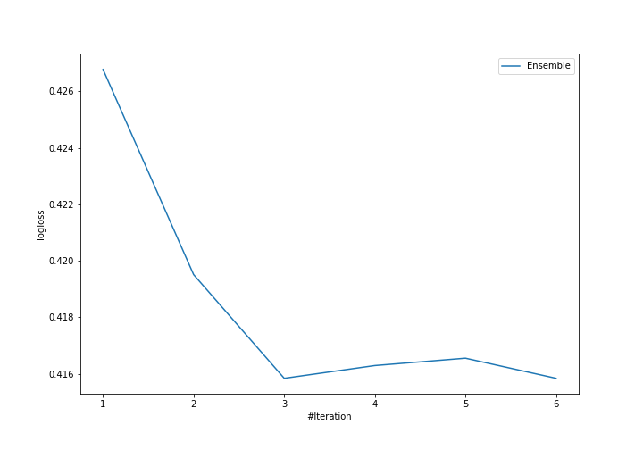
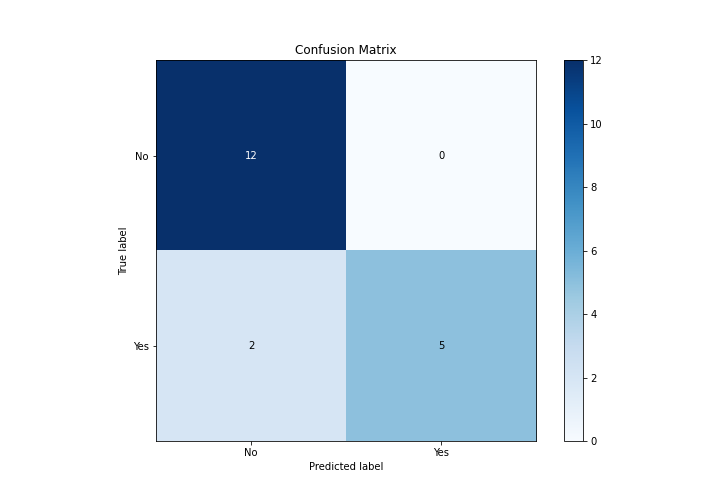
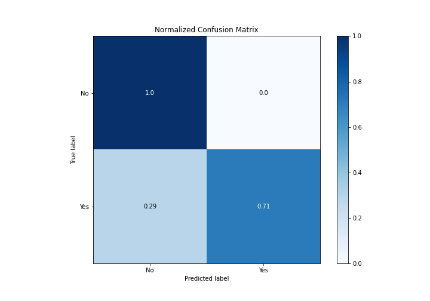
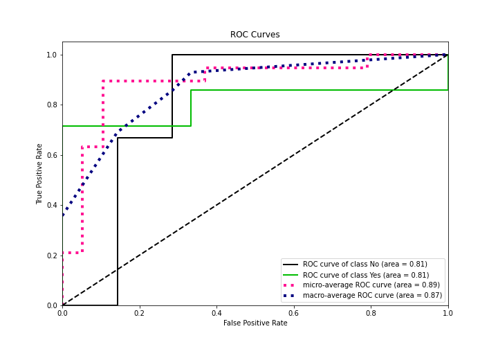
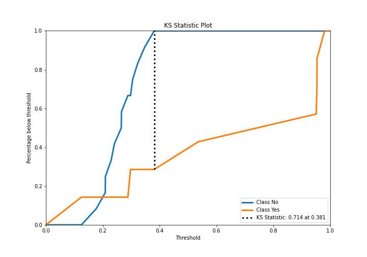
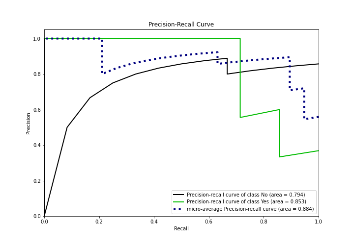
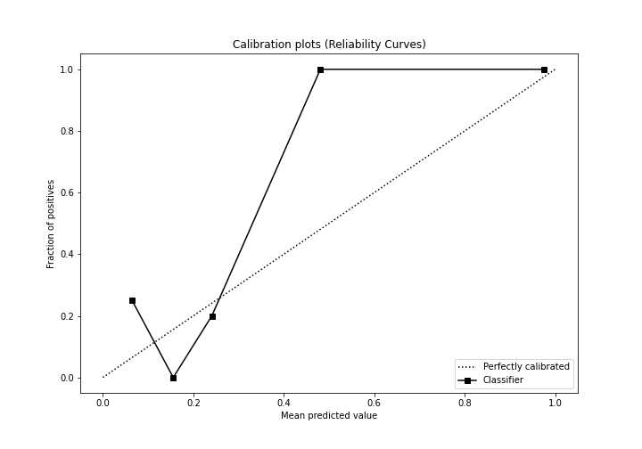
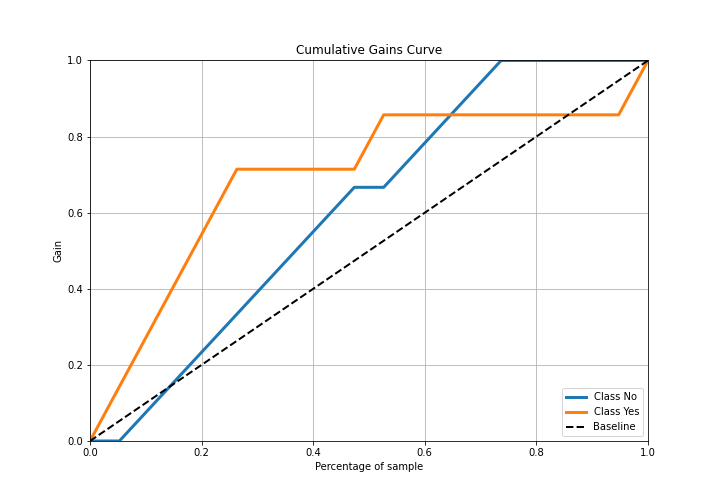
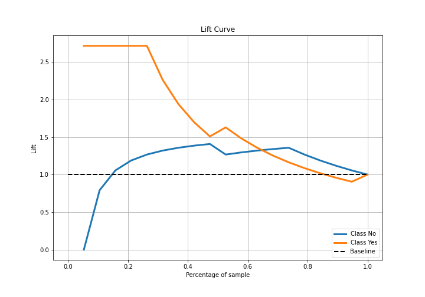

# Summary of Ensemble

[<< Go back](../README.md)

## Ensemble structure
| Model                  |   Weight |
|:-----------------------|---------:|
| 3_Linear               |        1 |
| 6_Default_RandomForest |        2 |

## Metric details
|           |    score |   threshold |
|:----------|---------:|------------:|
| logloss   | 0.415842 |  nan        |
| auc       | 0.809524 |  nan        |
| f1        | 0.833333 |    0.382845 |
| accuracy  | 0.894737 |    0.382845 |
| precision | 1        |    0.382845 |
| recall    | 1        |    0.112398 |
| mcc       | 0.782461 |    0.382845 |

## Metric details with threshold from accuracy metric
|           |    score |   threshold |
|:----------|---------:|------------:|
| logloss   | 0.415842 |  nan        |
| auc       | 0.809524 |  nan        |
| f1        | 0.833333 |    0.382845 |
| accuracy  | 0.894737 |    0.382845 |
| precision | 1        |    0.382845 |
| recall    | 0.714286 |    0.382845 |
| mcc       | 0.782461 |    0.382845 |

## Confusion matrix (at threshold=0.382845)
|                |   Predicted as No |   Predicted as Yes |
|:---------------|------------------:|-------------------:|
| Labeled as No  |                12 |                  0 |
| Labeled as Yes |                 2 |                  5 |

## Learning curves

## Confusion Matrix

## Normalized Confusion Matrix

## ROC Curve

## Kolmogorov-Smirnov Statistic

## Precision-Recall Curve

## Calibration Curve

## Cumulative Gains Curve

## Lift Curve

[<< Go back](../README.md)
