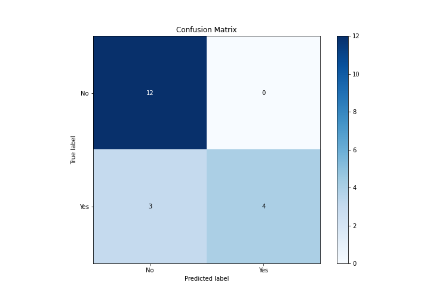

# Summary of 2_DecisionTree

[<< Go back](../README.md)

## Decision Tree
- **n_jobs**: -1
- **criterion**: gini
- **max_depth**: 3
- **explain_level**: 2

## Validation
 - **validation_type**: split
 - **train_ratio**: 0.75
 - **shuffle**: True
 - **stratify**: True

## Optimized metric
logloss

## Training time

11.2 seconds

## Metric details
|           |    score |   threshold |
|:----------|---------:|------------:|
| logloss   | 1.7814   |   nan       |
| auc       | 0.660714 |   nan       |
| f1        | 0.727273 |     0.37931 |
| accuracy  | 0.842105 |     0.37931 |
| precision | 1        |     0.37931 |
| recall    | 0.714286 |     0       |
| mcc       | 0.676123 |     0.37931 |

## Metric details with threshold from accuracy metric
|           |    score |   threshold |
|:----------|---------:|------------:|
| logloss   | 1.7814   |   nan       |
| auc       | 0.660714 |   nan       |
| f1        | 0.727273 |     0.37931 |
| accuracy  | 0.842105 |     0.37931 |
| precision | 1        |     0.37931 |
| recall    | 0.571429 |     0.37931 |
| mcc       | 0.676123 |     0.37931 |

## Confusion matrix (at threshold=0.37931)
|                |   Predicted as No |   Predicted as Yes |
|:---------------|------------------:|-------------------:|
| Labeled as No  |                12 |                  0 |
| Labeled as Yes |                 3 |                  4 |

## Learning curves

## Decision Tree 

### Tree #1

### Rules

if (Marital status <= 0.5) and (Your current year of Study <= 3.5) and (Your current year of Study > 1.5) then class: No (proba: 62.07%) | based on 29 samples

if (Marital status <= 0.5) and (Your current year of Study > 3.5) then class: No (proba: 100.0%) | based on 12 samples

if (Marital status > 0.5) then class: Yes (proba: 100.0%) | based on 8 samples

if (Marital status <= 0.5) and (Your current year of Study <= 3.5) and (Your current year of Study <= 1.5) then class: No (proba: 100.0%) | based on 7 samples

## Permutation-based Importance

## Confusion Matrix

## Normalized Confusion Matrix

## ROC Curve

## Kolmogorov-Smirnov Statistic

## Precision-Recall Curve

## Calibration Curve

## Cumulative Gains Curve

## Lift Curve

## SHAP Importance

## SHAP Dependence plots

### Dependence (Fold 1)

## SHAP Decision plots

### Top-10 Worst decisions for class 0 (Fold 1)

### Top-10 Best decisions for class 0 (Fold 1)

### Top-10 Worst decisions for class 1 (Fold 1)

### Top-10 Best decisions for class 1 (Fold 1)

[<< Go back](../README.md)
